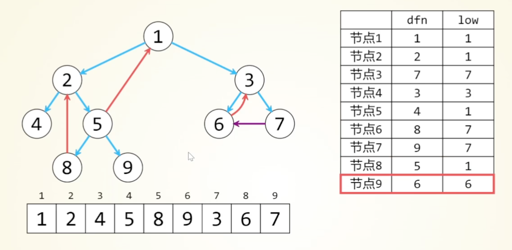

这是一个跨应用 Java 代码调用链分析 skill：从一个精确入口方法出发，把「谁调它（上游）和「它调谁（下游）」展开成一张有向图，每条边都带证据，最终产出一份「AI 可读、可复核、可续跑」的调用链文档。它的价值不在"能画图"，而在于用工程手段强制保证分析的完整性和可信度。

# 一、目录结构与三层职责分工

```txt
code-operation-center/
    — SKILL.md  # L1 主流程编排（给 LLM 读的"操作手册")
    — agents/openai.yaml  # 技能入口元数据（display_name / default_prompt）
    |
    — templates/  # 5 份方法论指南（按需 read）
        — codegraph-setup.md  # CodeGraph 索引的安装/构建
        — tool-strategy.md  # 三层工具协同 + 单跳取证
        — graph-traversal-and-completeness.md  # 状态机 + 完整性校验
        — cross-application-resolution.md  # 跨应用边解析（RPC/HTTP/MQ）
        — output-template.md  # 12 段式输出文档模板
    — scripts/
        — call_graph_session.py  # 核心引擎（会话状态机，1000+行）
        — workspace_inventory.py  # 工作区项目盘点
```

核心设计思想：LLM 负责"判断"，脚本负责"记账与守规"。这是整个 skill 最精妙的地方——它不是让大模型直接"一口气生成整棵调用树"，而是把大模型能力和确定性程序严格分工：

<table><tr><td>角色</td><td>承担</td><td>不允许承担</td></tr><tr><td>LLM (读 SKILL.md 执行)</td><td>读源码、判断一跳邻居、识别分支/动态分派、写证据</td><td>不能自己维护图状态、不能自称&quot;完整&quot;</td></tr><tr><td>call_graph_session.py (确定性程序)</td><td>图去重、状态机推进、预算控制、证据门槛校验、完整性判定、渲染</td><td>不做语义判断</td></tr><tr><td>CodeGraph (外部索引工具)</td><td>提供精确符号、直接调用关系事实</td><td>不判断业务边界</td></tr></table>

大模型天生会"幻觉"和"偷懒采样"，这个 skill 用一个 Python 状态机把大模型关进笼子里——你说完整？先通过 validate --require-complete 。

# 二、核心设计思想（4 个关键决策）

## 设计思想 1：把调用链当"有向图"而非"树"

graph-traversal-and-completeness.md 开篇就点破：

调用链表面像树，实际是有向图：多个分支会汇合，同一工具方法会被反复调用，递归和回调会形成环。按树递归会指数重复。

对策是"规范节点 + 唯一边 + 双向前沿"：

• 规范节点 ID： 应用::全限定类名#方法名(参数类型):返回类型 ，例如 order-app::com.acme.OrderService#submit(com.acme.Request):com.acme.Result 。用完整签名区分重载，绝不用类简称合并节点。

• 边去重：按 caller + callee + edge_type 唯一化（脚本 edge_key() 用 → 拼键），重复发现只合并证据不新建边。

• 环检测：递归边保留回边，但已处理节点不再入队（脚本用 Tarjan 算法strongly_connected_components() 识别循环组，用于在渲染时向用户展示潜在的循环调用）。

强连通图是图中的每个节点都是互相可达的，强连通分量就是一张图中的强连通子图，Tarjan算法的目标就是识别一张图中的所有强连通子图，将强连通子图看成是一个大的节点，这样整张图就是一张有向无环图，这可以极大的简化一张图的结构，更有利于Agent去分析这张图的性质。

◦ 算法的底层逻辑就是DPS深度优先遍历算法，DPS的过程很简单，就是从图中的某一个节点出发，不断的入栈和出栈的过程。Tarjan算法就是在出栈的时候做了一件事，会去识别顶部节点，如果当前出栈的节点是顶部节点，就会把当前出栈的节点和之前出栈的节点记录成一张强连通子图，已经被记录过的节点不会再被记录。

顶部节点就是强连通子图中最浅的那个节点，从它出发可以找到一张强连通子图中所有的节点，剩下的最关键问题就是如何去识别一张图中所有的顶部节点。DFS算法可以遍历一张图中的所有节点，一个节点在遍历当中的顺序值就是dfn值，用一个dfn数组维护。一个节点的low值就是节点在dfs遍历次序上可以回溯到的最左边节点的dfn值。以节点7为例，它在dfs次序表上可以走到的最左边节点就是节点3，节点3的dfn值是7，那么节点7的low值就是7。在下图中的这张表中，dfn值和low值相等的节点就是强连通子图的最顶部节点。




<table><tr><td>1</td><td>2</td><td>3</td><td>4</td><td>5</td><td>6</td><td>7</td><td>8</td><td>9</td></tr><tr><td>1</td><td>2</td><td>4</td><td>5</td><td>8</td><td>9</td><td>3</td><td>6</td><td>7</td></tr></table>

<table><tr><td></td><td>dfn</td><td>low</td></tr><tr><td>节点1</td><td>1</td><td>1</td></tr><tr><td>节点2</td><td>2</td><td>1</td></tr><tr><td>节点3</td><td>7</td><td>7</td></tr><tr><td>节点4</td><td>3</td><td>3</td></tr><tr><td>节点5</td><td>4</td><td>1</td></tr><tr><td>节点6</td><td>8</td><td>7</td></tr><tr><td>节点7</td><td>9</td><td>7</td></tr><tr><td>节点8</td><td>5</td><td>1</td></tr><tr><td>节点9</td><td>6</td><td>6</td></tr></table>

```python
def strongly_connected_components(session: dict[str, Any]) -> list[list[str]]:
    """基于 Tarjan 算法计算图中「大小 > 1 或含自环」的强连通分量。

    用于在渲染时向用户展示潜在的循环调用；实现上采用迭代式栈避免深图递归栈溢出。
    """
    adjacency: dict[str, list[str]] = {node_id: [] for node_id in session["nodes"]}
    self_loops: set[str] = set()
    for edge in session["edges"].values():
        adjacency[edge["caller"]].append(edge["callee"])
        if edge["caller"] == edge["callee"]:
            self_loops.add(edge["caller"])
    index = 0
    stack: list[str] = []
    on_stack: set[str] = set()
    indices: dict[str, int] = {}
    lowlink: dict[str, int] = {}
    result: list[list[str]] = []

    def connect(node_id: str) -> None:
        nonlocal index
        indices[node_id] = index
        lowlink[node_id] = index
        index += 1
        stack.append(node_id)
        on_stack.add(node_id)
        for target in adjacency[node_id]:
            if target not in indices:
                connect(target)
                lowlink[node_id] = min(lowlink[node_id], lowlink[target])
            elif target in on_stack:
                lowlink[node_id] = min(lowlink[node_id], indices[target])
        if lowlink[node_id] == indices[node_id]:
            component: list[str] = []
            while True:
                target = stack.pop()
                on_stack.remove(target)
                component.append(target)
                if target == node_id:
                    break
            if len(component) > 1 or node_id in self_loops:
                result.append(sorted(component))

    for node_id in adjacency:
        if node_id not in indices:
            connect(node_id)
    return result
```

效果：每个节点在每个方向上最多展开一次，从根本上避免指数爆炸。

## 设计思想 2：双向独立前沿 + 单跳队列（BFS 而非 DFS 递归）

会话里维护两个独立状态机：

- downstream：入口 $\rightarrow$ 它调用的方法

upstream ：入口 → 谁调用了它

每个节点在每个方向上有一套状态（ call_graph_session.py:46 ）：

```txt
unseen → pending → in_progress → expanded
    terminal (已证实的边界)
    unresolved (待用户确认)
    deferred (预算受限)
```

关键约束（SKILL.md 第 3 条）：每次只发现并验证一个节点的直接一跳邻居，再写回会话；禁止让工具递归生成整棵图。工作流就是不断 next （取下一个待展开任务）→ 分析→ expand （写回一跳）→ 循环，直到两个前沿队列都清空。

```txt
这个 INCOMPLETE_STATES = {pending, in_progress, unresolved,
```

## 设计思想 3：分层取证 + 证据门槛（对抗幻觉）

tool-strategy.md 的三层策略：

<table><tr><td>层级</td><td>工具</td><td>职责</td></tr><tr><td>1</td><td>CodeGraph</td><td>精确符号、直接调用关系、动态分派候选(首选事实来源)</td></tr><tr><td>2</td><td>源码 + rg</td><td>核对调用点、注解、XML/YAML、Bean/RPC 配置</td></tr><tr><td>3</td><td>源码结构分析</td><td>补充分支/责任链/策略表/lambda 等语义</td></tr></table>

每条边强制携带 evidence 数组（脚本 normalized_evidence() 拒绝空证据），置信度分三档： confirmed / probable / unresolved 。"文本命中"不等于"方法级调用"—类级命中不能直接记为方法级边，必须回读方法体证明调用者身份。

## 设计思想 4：不确定就阻塞问用户，绝不猜测

SKILL.md 第 5 条："搜不到不等于不存在"。遇到 RPC 目标应用不唯一、找不到上游消费者、反射/SPI 无法解析时，用 block 挂起并把候选列给用户，等 confirm 后再继续。这是防止"AI编造调用关系"的最后防线。

# 三、核心引擎 call_graph_session.py 工作机制

这是一个基于单个 JSON 会话文件的原子状态机。10 个子命令：

<table><tr><td>命令</td><td>作用</td></tr><tr><td>init</td><td>建会话,登记入口方法,两方向都置 pending、深度 0</td></tr><tr><td>next</td><td>从 frontier 取下一个待展开任务</td></tr><tr><td>expand</td><td>原子写入一跳发现(增节点/边、推状态、生 block)</td></tr><tr><td>terminal</td><td>标记已核实边界(上游 terminal强制要 user_confirmation)</td></tr><tr><td>block / confirm</td><td>挂起疑问 / 用户回答后解决</td></tr><tr><td>set-budget</td><td>提升预算(只能增不能减)</td></tr><tr><td>status / validate</td><td>进度摘要 / 完整性校验</td></tr><tr><td>render</td><td>渲染成 Markdown 事实底稿</td></tr></table>

几个工程细节值得称道：

• 原子写盘（ atomic_write_json ）：先写临时文件 + fsync，再 os.replace 原子替换，保证崩溃不写坏会话 →可随时续跑。

• 预算护栏（ budget_precheck ）：写入前预估节点/边/应用/深度/fan-out 是否超限，超了就 BudgetError 拒绝并保留会话，而不是静默裁剪。

• 跨应用证据门槛（ cross_app_evidence_is_complete ）：一条 RPC 边要标confirmed ，必须同时有 contract （契约）+ implementation （实现）+ registration/configuration/user_confirmation （三选一）。这是硬编码在程序里的、大模型绕不过去的规则。

# 四、举例说明完整工作机制

下面用一个真实需求把上面所有机制串起来看：**"豆池不足时下线奖品和活动"**。需求一句话——发奖接口在识别到下游京豆服务返回"豆池余额不足"时，要**暂停该奖品 + 暂停奖品所在的活动**。这是一个典型的跨应用链路分析场景（活动中心 + 奖品中心 + 外部京豆服务），正好能展示 skill 的每一步。

> 需求文档、初版技术方案在 `<super-development-assistant>/references/豆池不足时下线奖品和活动/` 下；下文的行号证据均来自 `market-activity-center` / `market-prize-center` 两套真实工程。

## 4.0 起点：用户给了什么、我要什么

- 用户给的：PRD + 一页初版技术方案（"活动中心发奖 → 奖品中心执行 → 调京豆 → 余额不足 → 暂停奖品并返回异常码 → 活动中心识别并暂停活动"），以及一个诉求——**"我是新人，想搞懂这次改动背后整条链路，再给设计方案，先别动代码"**。
- 这句话触发了 SKILL.md 第 7 条的判定：用户要的是**调用链 + 跨应用逻辑 + 影响面**，不是"某个方法在哪一行"——因此必须进入**链路模式**，建持久化会话，禁止用几次源码搜索冒充完整分析。

## 4.1 第 0 步：检查 CodeGraph 环境（真实踩坑）

skill 要求 CodeGraph 作为首选事实来源，所以第一步是确认它能在 Agent 的非交互 shell 里跑起来。这一步真实遇到了两个坑，正好对应 `codegraph-setup.md` 的告警：

```bash
# ❌ 第一次尝试：命令替换被沙箱安全策略拦截
which codegraph && node --version && codegraph --version
# 报错：$(...) / 组合命令被拦

# ✅ 改为显式、单条命令确认；并发现 codegraph 是 #!/usr/bin/env node 脚本，
#    但 Agent shell 的 PATH 里没有 node，需要为「本次命令」显式补齐 NVM 的 node 目录
PATH=/Users/wangshaofan.7/.nvm/versions/node/v24.18.0/bin:$PATH node --version   # v24.18.0
PATH=/Users/wangshaofan.7/.nvm/versions/node/v24.18.0/bin:$PATH codegraph --version
```

关键纪律（SKILL.md 第 0 步第 5 条）：**只为本次命令补 `PATH`，绝不改用户的 `~/.zshrc` / NVM 默认版本 / 全局 node 软链**，并把"发现的 node 绝对目录"记进会话元数据，后续每条 codegraph 命令都带上这个前缀。

## 4.2 第 1 步：强制盘点工作区 + 建索引

**盘点**（skill 把"可先盘点"升级为强制动作）：

```bash
python3 <super-development-assistant>/skills/code-operation-center/scripts/workspace_inventory.py \
  --root /Users/wangshaofan.7/work/company --pretty
```

产出：工作区 43 个应用清单，以及每个应用是否已有 `.codegraph/` 索引。据此确认入口两个应用 `market-activity-center`、`market-prize-center` **都还没有索引**。

**建索引**（对每个进入调用图的应用）：

```bash
cd /Users/wangshaofan.7/work/company/market-prize-center    && PATH=/Users/.../v24.18.0/bin:$PATH codegraph init -i
cd /Users/wangshaofan.7/work/company/market-activity-center && PATH=/Users/.../v24.18.0/bin:$PATH codegraph init -i
```

**过程产物**（真实落在磁盘上，可复核、可续跑）：

| 应用 | 索引产物 | 规模 |
|---|---|---|
| market-prize-center | `market-prize-center/.codegraph/codegraph.db`（约 103 MB） | method 节点 7,825 |
| market-activity-center | `market-activity-center/.codegraph/codegraph.db`（约 79 MB） | 22,818 节点 |

> `.codegraph/` 带 `.gitignore`，不进版本库；后续代码推送门禁时把它从提交里排除（还原到 `.git/info/exclude`）。

## 4.3 第 2 步：初始化可恢复会话（双向前沿）

以活动中心发奖分派方法为入口，`init` 建会话，脚本同时创建 `upstream` / `downstream` 两个前沿、深度 0、状态 `pending`：

```bash
python3 <super-development-assistant>/skills/code-operation-center/scripts/call_graph_session.py init \
  /absolute/output/call-graph-session.json \
  --app market-activity-center \
  --project /Users/wangshaofan.7/work/company/market-activity-center \
  --method 'com.jdpay.market.activity.center.remote.prize.TakePrizeRemoteService#takeSinglePrize(...):...' \
  --workspace-root /Users/wangshaofan.7/work/company
```

**过程产物**：一个 `call-graph-session.json` 会话文件——它就是整个分析的"账本"，`init` 之后每一跳都靠 `next`/`expand` 原子写回它。**没有这个会话文件，就等于没执行 code-operation-center。**

## 4.4 第 3~5 步：双向单跳 BFS（本次分析的主体）

核心循环：`next`（取一个待展开节点）→ 用 CodeGraph 取源码/直接邻居 → 逐个核对签名/调用点/分支 → `expand` 原子写回一跳 → 再 `next`……直到两个前沿都清空。**每次只走一跳，绝不让工具一口气递归生成整棵树。**

### 下游方向（入口 → 它调谁）实际走出的链路

```bash
python3 .../call_graph_session.py next /absolute/output/call-graph-session.json --direction downstream
# 分析当前节点后，把这一跳的邻居写成 expansion JSON，再原子写回：
python3 .../call_graph_session.py expand /absolute/output/call-graph-session.json --input hop.json
```

一跳一跳走出来的下游图（每条边都带真实行号证据）：

```
活动中心 TakePrizeRemoteService.takeSinglePrize()
  └─ switch(prizeCategory)                                   [TakePrizeRemoteService.java:92]
       ├─ case INTER_PRIZE  → userInterApiRpc.take()          ← 京豆走这条
       └─ case RED_PACKET_PRIZE → userRedPacketApiRpc.takeByPin()
  ── JSF RPC 跨应用 ──▼   (cross_app_candidate → 跨应用待办)
奖品中心 UserInterApiImpl.take()
  └─ TakeInterBiz.takeByPin() → takeByPinCoreOld()
       └─ case JING_DOU → jDouRemoteInvoker.take(...)         [TakeInterBiz.java:1244 / :1255]
奖品中心 JDouRemoteInvoker.take()
  └─ jingBeanJsfFacade.incomeBeans(request)                  [JDouRemoteInvoker.java:183]
  ── JSF RPC 跨应用 ──▼
京豆中心 (MARKETING-JDOU-CENTER)  ← 工作区外，无源码 = terminal 边界
```

- 跨应用边解析（`cross-application-resolution.md`）：`INTER_PRIZE → userInterApiRpc.take()` 是个 JSF 客户端代理，**不能当终点**。用 `rg` 在 `jsf.properties` 里核对 alias，定位到奖品中心的 Provider 实现 `UserInterApiImpl.take()`，形成"契约 + 实现 + 注册"三角证据后才记为一条真实 `rpc` 边并从 Provider 继续下钻。
- 真正的外部边界：`JDouRemoteInvoker.take() → incomeBeans()` 打到 `jsf.alias.jdou.MarketJingDouApi=MARKETING-JDOU-CENTER`（`jsf.properties:262`）——京豆中心工作区内无源码，用 `terminal` 记为边界，不再展开：

```bash
python3 .../call_graph_session.py terminal /absolute/output/call-graph-session.json \
  --node 'market-prize-center::...JDouRemoteInvoker#take(...):...' \
  --direction downstream --reason 'external app: MARKETING-JDOU-CENTER (no source)' \
  --evidence-kind source --evidence-detail 'jsf.properties:262 jsf.alias.jdou.MarketJingDouApi=MARKETING-JDOU-CENTER'
```

### 关键取证：豆池不足到底是哪个返回码

沿着京豆链路回读 `JingBeanJsfFacadeEnum` 返回码枚举，这是本次需求的命门：

| code | 枚举 | 含义 | 现状 |
|---|---|---|---|
| `0000` | SUCCESS | 成功 | — |
| `0003` | CUSTOMER_BALANCE_INSUFFICIENT | 用户账户余额不足 | 回收侧才识别，发放侧不触发暂停 |
| `0010` | EXCEED_POOL_BALANCE | **京豆超发 / 豆池余额相关** | ⚠️ 与 PRD"豆池余额不足"最贴近，**但发放侧 `take()` 当前根本没识别这个码** |

- 发现的**缺口**：`JDouRemoteInvoker.take()`（`:162~232`）对非成功码统一抛 `TakeInterPrizeFailException`，**没有对 0010 做特殊分支，也就没触发任何暂停**。这就是需求要补的洞。
- 发现的**样板**：红包链路早就闭环了"余额不足 → 暂停"——`AsynTakeRedPacketBiz.java:159` 里 `if (e instanceof BalanceInsufficientException) { prizePauseSwitch.turnOff(...); changeActivityStatusEventSender.synchSendMQ(activityId, ONLINE, PAUSE); }`。于是结论是"把红包已验证的模式补齐到京豆链路"，而不是从零造轮子。

### 上游方向（入口 → 谁调它）

对 `TakePrizeRemoteService` / `UserInterApiImpl` 做反向单跳，核对调用方（`TakePrizeBiz`、`BizSourceTakePrizeBiz`、`PayAfterBiz` 等），并对 `UserInterApiImpl`（ApiImpl）这个候选服务边界确认它的 JSF 消费者，直到用户确认已到业务最上层。上游 `terminal` 强制要 `user_confirmation`。

## 4.5 第 4/6 步：跨应用待办 + 遇到不确定就 block

链路里每个 RPC/MQ 都生成一项"跨应用待办"。本次两条 JSF 边（活动中心→奖品中心、奖品中心→京豆）+ 一条活动状态变更 MQ：

- **暂停活动**追出两条并存通道，都要走通不能采样：
  - 通道 A：奖品中心 `ChangeActivityStatusEventSender.synchSendMQ` 发 MQ `topic.activity_status_change` → 活动中心 / `market-manager` 的 `ActivityStatusChangeListener` 消费（用 `grep` 在 `jmq.xml` 里核对 topic 绑定，确认活动中心 Listener 只维护缓存关系、**不落库**）。
  - 通道 B：活动中心 `TakePrizeRemoteService` 对余额不足码调 `pauseActivityProcessor.submit(activityId)` → `BudgetInsufficientPauseReductionProcessor.pauseActivity` → `ActivityInterPrizeService.changeActivityStatus(...PAUSE)`（**这条才真正把活动状态落库为 PAUSE**）。

当 MQ topic 配置一时定位不到消费端时，按 skill 用 `block` 挂起而不是猜测；补搜到 `jmq.xml` 绑定后再继续（本次第 2 次交互就是承接上一次因搜索 `change_activity_status_operate` 而中断的分析继续跑完的）。

## 4.6 第 6.1 步：跨应用状态变更账本（写业务结论的前置门禁）

因为需求涉及"暂停"状态语义，skill 强制在下结论前建账本，且**不同应用同名状态必须带前缀、不能按中文名混用**：

| 事件 | 应用 | 状态字段与 code | 后置状态 | 是否落库 |
|---|---|---|---|---|
| 暂停奖品 | 奖品中心 | `StatusEnum` | `OFF` | 是（按 `PrizeIdUtils.inferCategory` 选对应 Dao） |
| 暂停活动·通道A | 活动中心 Listener | 缓存关系 | — | **否（只维护缓存）** |
| 暂停活动·通道B | 活动中心 | `ActivityStatusEnum` | `PAUSE` | **是** |
| 返回码 | 奖品中心 API | `MarketPrizeCenterRespCodeEnum.BALANCE_INSUFFICIENT` | `MPC20013` | — |

有了这张账本才能得出正确结论："**必须保留通道 B**，因为只有它落库；通道 A 的活动中心 Listener 并不改活动状态"——这个结论如果不建账本、只凭中文名"暂停活动"直觉，就会漏掉。

## 4.7 第 7 步：校验 + 渲染事实底稿 + 写业务指南

```bash
# 完整性校验：所有节点两个方向达终态、跨应用待办 resolved/blocked，才允许说"完整"
python3 .../call_graph_session.py validate /absolute/output/call-graph-session.json --require-complete
# 渲染事实底稿（节点/边/证据/未决项/状态账本/覆盖率）
python3 .../call_graph_session.py render /absolute/output/call-graph-session.json --output /absolute/output/code-call-graph.md
```

只有 `validate --require-complete` 通过后，才在事实底稿上补业务语义，产出最终交付：

- **`第二步-设计方案/开发指南.md`**（19KB）——TL;DR、应用与索引、发奖主链路（mermaid + 行号证据）、京豆返回码表、红包样板、暂停两通道、跨应用状态账本、四步落地方案、**7 个待对齐卡点**、影响面与回归、行号索引附录。因为单次写入参数过大，采用先 `write` 骨架再多次 `append` 续写的方式落盘。
- **`第二步-设计方案/Agent执行路径.md`**——按交互逐条记录上面这套命令与步骤，供复盘。

## 4.8 这个实例暴露出的三条"卡点"，正是 skill 价值所在

分析闭环后，向用户抛出必须对齐、Agent 不能自行拍板的卡点（对应 SKILL.md"不确定就问、绝不猜测"）：

1. **返回码到底用哪个**：`0010`（豆池/超发）还是别的？——Agent 不臆断，标为卡点让用户去和零售确认（后续用户回复"京豆余额不足返回码是 0010"，只改 `JDouRemoteInvoker` 一处识别点，上层按异常类型解耦不动）。
2. **京豆 prizeId 能否被 `inferCategory` 正确判成 INTER** → 决定暂停奖品时选对 Dao。
3. **通道 A/B 是否都要保留** → 账本证明必须保留落库的通道 B。

> 一句话复盘：**盘点 → 建索引 → init 会话 → 双向单跳 BFS（next/expand）→ 跨应用边三角取证 → 状态账本 → validate → render → 写指南**，每一跳都落进 `call-graph-session.json` 这本账，最后靠 `validate --require-complete` 机器判定"是否真的分析完整"，而不是靠 Agent 自我感觉良好。

# 五、总结：这个 skill 的精髓

1. 人机分工把幻觉锁死：语义判断交给 LLM，图状态/去重/预算/完整性交给确定性 Python 程序——大模型无法"骗过" validate --require-complete 。

2. 图论建模防爆炸：规范节点 + 唯一边 + 双向前沿 + 单跳队列 + Tarjan 环检测，让 O(指数)降到每节点每方向展开一次。

3. 证据驱动、门槛硬编码：每条边必须有证据，跨应用边有三角色证据门槛，绝不允许"文本命中即调用"。

4. 可恢复 + 预算护栏：原子写盘让任意时刻可续跑；超预算只暂停问用户，绝不静默采样裁剪。

5. 完整性是"整体性质"： expanded 只证明一跳穷举，真正的"完整"是所有可达节点都达终态这套状态机把"我分析完了吗"变成了一个可机器判定的命题。
