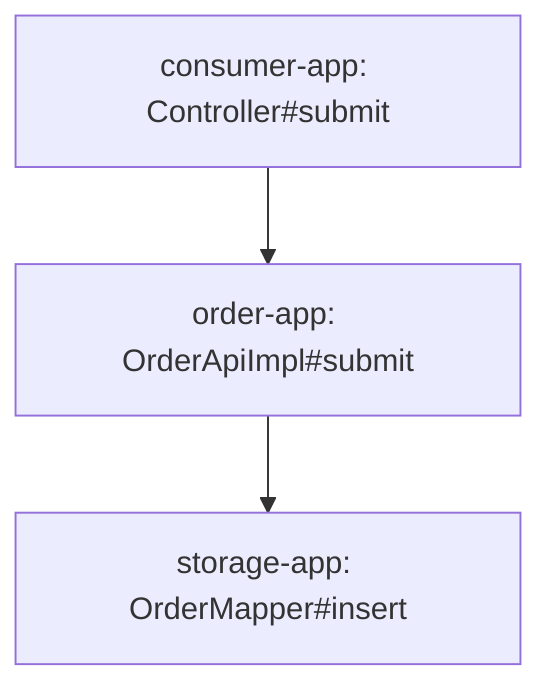

# AI 可读代码链路文档模板

事实底稿由 `call_graph_session.py render` 生成。AI 可以补充业务解释，但不能删改底稿事实，不能把 `probable`/`unresolved` 写成确定结论。

## 文档结构

```markdown
# <入口方法> 跨应用双向代码链路

## 1. 分析元数据
- 入口：<canonical method id>
- 生成时间：<timestamp>
- 工作区：<roots>
- 应用：<count/list>
- 工具与版本：<CodeGraph / source / rg>
- 分析范围：<project-owned code and boundary definition>
- 完整性：COMPLETE / INCOMPLETE

## 2. 执行摘要
<用 5-10 句话说明入口职责、主要上游来源、主要下游落点、跨应用数量、关键分叉和残余风险。>

## 3. 覆盖率与限制
| 方向 | expanded | terminal | pending | unresolved | deferred | 覆盖状态 |
|---|---:|---:|---:|---:|---:|---|

<列出用户限定的工作区、无法取得源码的边界、用户确认。>

## 4. 应用地图
| App | Project path | CodeGraph | 在链路中的角色 |
|---|---|---|---|

## 5. 上游调用图
<先给按应用分组的 Mermaid 概览，再给无损文本调用图。共享子图使用 ↩ [Nxxxx] 引用。>

## 6. 下游调用图
<先给按应用分组的 Mermaid 概览，再给无损文本调用图。标注分支、跨应用边和持久层终点。>

## 7. 跨应用边
| Caller app/method | 协议 | Contract/route | Provider app/method | 绑定证据 | 置信度 |
|---|---|---|---|---|---|

## 8. 数据与外部边界
| 类型 | 发起方法 | 目标 | 操作 | 证据 |
|---|---|---|---|---|

## 9. 分支、动态分派与循环
<说明 if/switch/责任链/策略/lambda 的目标集合，以及 SCC/递归回边。>

## 10. 未决项与用户确认
<完整列出 unresolved、搜索范围、候选、确认问题和用户回答。没有则写“无”。>

## 11. 节点目录
| Node ID | Application | Full method signature | Source | 双向状态 |
|---|---|---|---|---|

## 12. 边与证据附录
| Caller | Callee | Type | Branch/callsite | Confidence | Evidence |
|---|---|---|---|---|---|
```

## Mermaid 约束

Mermaid 只做概览，不承担完整事实表达：大型图会超出渲染限制。建议应用级或边界级节点不超过 80 个，其余链路保留在文本树和边表中。节点标签包含标点时使用引号。



不要为了让图好看而丢弃分支。若概览折叠节点，明确写“完整边见第 12 节”。

## AI 阅读友好规则

- 首次出现使用完整签名，后续可用稳定 Node ID 引用。
- 调用图保持真实 caller -> callee 方向，上游章节也不能反画箭头。
- 分支条件紧贴对应边，不把静态可达误写成运行时必经。
- `confirmed`、`probable`、`unresolved` 使用固定词汇。
- 明确区分“代码可达”“配置绑定”“用户确认”“运行时观测”。
- 同一共享子图只完整展示一次，其他位置写 `↩ [Node ID]`。
- 报告为 INCOMPLETE 时，把剩余前沿与下一步操作放在执行摘要首段。

## 完成措辞

只有 `validate --require-complete` 成功时可以写：

> 在所列工作区和边界定义内，上下游可达项目代码及可解析跨应用边已完整展开。

否则必须写：

> 当前文档是可恢复的部分分析结果，尚有 <数量> 个未决/待展开节点，不能视为完整调用图。
