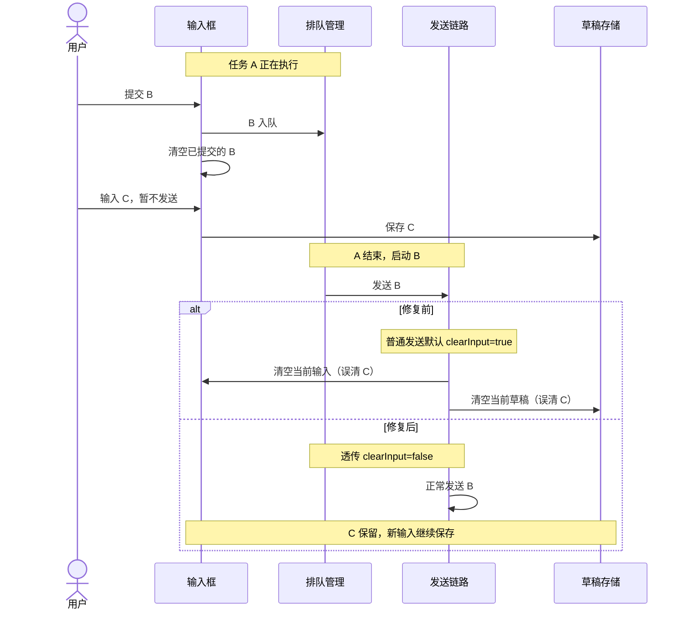

# JingleAI研发规范与协作流程

> [!info] 已确认 · 项目规范与用户协作约定
> 原有规范保留 2026-09-17 的已确认源码快照；2026-09-21 新增的应用定位、动态月度分支选择、任务分支命名与交付流程已由用户审查通过并合入。排队问题仅作为一张时序图和交付凭据保留。执行任务时仍需核对当前仓库规则、版本及授权范围。

## 这份笔记如何使用

这是规范的中文速查与阅读路由，不是新的一套工程规则。执行任务时应读取仓库当前 `AGENTS.md`、父级/最近局部规则和命中的专项规则；知识库快照不能替代它们。

## 三条必须先记住的边界

1. **Kernel 边界**：Desk 访问运行时有状态能力只走 IKernelEngine、Plugin SDK、Gateway RPC。精确公开类型/纯函数导出也需通过边界检查；禁止 deep import、shim 或共享内部单例。
2. **Memory 单源**：本地 JSONL 为记忆权威，SQLite ai_messages 为 UI 投影；跨端业务权威另按 Cloud 消息架构，不能混为第二套事实源。
3. **AI 配置单源**：AGENTS.md 与 docs/ai 承载正文，Cursor/Claude 只允许约定的薄适配；不要另建 .codex/.agents 等开发规则目录。运行时插件元数据的精确例外以治理文档为准。

## 工程组织与类型

| 范围          | 要点                                                              | 当前原文                                    |
| ----------- | --------------------------------------------------------------- | --------------------------------------- |
| 应用间         | app 只依赖共享包公开 API；跨应用走 HTTP/RPC/消息，不能共享内部表或单例作隐式合同               | `apps/AGENTS.md`                        |
| 共享包         | 不依赖 apps 实现或 Electron 全局；新增 export 就是新合同，检查消费者和兼容性              | `packages/AGENTS.md`                    |
| 通用设计        | 单一职责、权威状态唯一；没有真实第二实现不预建工厂/注册表/接口层                               | `coding-standards.md`                   |
| Node/NestJS | 边界校验、明确 DTO/schema、DI 管生命周期、Promise 与资源有归属                      | `backend.md`                            |
| Java/Cloud  | 强类型 DTO/command/result/entity；动态 JSON 留在适配边界；应用服务维护事务和授权        | `java-spring.md`、`apps/cloud/AGENTS.md` |
| 数据建模        | 权限、状态、查询、排序、唯一约束用类型化列/关系；文档型 JSON 要说明 schema/版本/迁移/回滚           | `data-modeling.md`                      |
| 前端          | 权威服务端数据、用户草稿、派生 UI 状态分开；竞态用请求身份/取消/版本解决                         | `frontend.md`                           |
| Vue         | Composition API、类型化 props/emits；按用户行为和生命周期拆组件，不维护重复派生状态         | `vue-component-standards.md`            |
| Electron    | Renderer 不直用 Node/Electron；preload 最小白名单；IPC 验证 sender、载荷、路径和权限 | `electron.md`                           |

固定结构不能以 any/Map/JSONObject 贯穿各层。真正动态的外部协议可以在窄 adapter 边界保留，不能机械地把所有 JSON 都拆成业务类。

新业务文件通常控制在 400 行内，超过 600 行需解释单一职责；新 Vue SFC 目标 300 行，超过 500 行需解释或按职责拆分。数字是评审信号，不是机械拆文件指标。遗留巨型入口不继续堆新用例。

## 任务分级与协作记录

| 等级 | 判据 | 最小要求 |
|---|---|---|
| T0 | 单会话、边界清楚、无公开合同/持久化/安全/架构风险的小改动 | 不登记 Harness；正常代码与验证证据 |
| T1 | 跨天/跨会话、需交接或保留决策 | task 条目 + planning |
| T2 | 公开协议、持久化、安全、跨模块架构重构或多人并行等 | T1 + contract、progress、review，并触发 Council 工作流 |

按最高风险判级，文件数量不决定等级。具体生命周期和 CLI 见 `harness-workflow.md`/`harness/README.md`，台账通过工具维护，不手改聚合数据。2026-09-17 原始整理属于仓外知识工作，没有修改业务仓库或创建工程任务记录。

## Git 与交付

- 开工先看 `git status --short --branch` 和本任务 diff，不 stash/restore/clean 他人改动。
- 集成主干以 `harness/INDEX.json#trunk` 为唯一来源，不能凭当前分支名或旧文档猜测。
- 仓库规范的任务分支形态为 `<type>/<YYYYMMDD>-<slug>`，具体工具执行还应遵循当前会话的上位指令。
- worktree 仅用于真实并发、长期挂起或用户要求；禁止在仓内 worktree 安装/升级 pnpm 依赖。
- commit/push/merge 按实际授权范围执行，不顺带发布；只包含本任务文件。
- 不跳过 hook，不向未知 remote 推送；不提交凭据、生产数据和个人绝对路径。
- 合入主干使用维护中的集成脚本与最新 trunk 验证，不能把本地单分支测试替代合并后的证据。

## Codex 接到问题后的应用、分支与交付约定

> [!note] 2026-09-21 用户明确的协作目标
> 用户只需描述清楚问题，Codex 自行识别应用、选择开发基线、生成任务分支名并完成已授权的交付步骤。用户确认 JoyDesk 每个月都有一个 feature 分支。不要反复索要能从项目知识、仓库规则和 Git 中确定的信息；存在无法消除的目标冲突时再提出具体问题。

### 从问题定位应用和 Git 仓库

先查 [[JingleAI项目知识总览]] 和相应应用专题，再用当前源码、入口和运行现象核验。下面是定位起点，不代表看到关键词就直接修改该应用。

| 用户描述的现象 | 优先定位的应用/目录 | 进一步判断 |
| --- | --- | --- |
| 桌面输入框、对话视图、按钮交互 | `apps/desk/frontend` | 定位实际 Renderer 组件和状态处理；涉及窗口/IPC 时继续到 `apps/desk/electron` |
| 桌面本机接口、宿主能力、启动 | `apps/desk/backend`、`apps/desk/electron` | 区分宿主行为和共享内核行为，不能因都在桌面里就修改前端 |
| 网页端页面交互 | `apps/desk-web` | 与桌面 Vue 前端区分 |
| 手机端交互 | `apps/mobile` | 按移动端专题核对当前入口与协议 |
| 协作、权限、跨端会话、管理后台 | `apps/cloud` | 沿客户端请求定位业务服务和数据权威 |
| 云端任务执行、沙箱、云端内核宿主 | `apps/kernel-runner` | 区分 Cloud 控制面与 Runner 执行面 |

业务应用可以位于同一个 `joy-desk` monorepo。IDE 打开的聚合目录也可能包含独立仓库：用 `git rev-parse --show-toplevel` 确定实际提交归属，不能把 `heavenly-palace` 的分支当成其内 `joy-desk` 的分支。代码入口在 `heavenly-palace/productivity/tool-library/joy-desk`；各应用目录以当前项目地图为准。

### 自动确定在哪个分支上处理

1. **用户指定分支或版本**：优先按指定目标定位并记录基线 SHA，不能用当前月份覆盖用户要求。
2. **生产故障只给版本/现象**：先查适用的发布记录与应用规范，找出该版本对应基线；月度开发分支不自动等于生产版本。证据缺失时只询问缺失的版本或目标，不把整个分支选择工作交回用户。
3. **普通开发/缺陷未指定版本**：读取 `harness/INDEX.json#trunk`，核对远端存在并取得合适的最新基线，再创建任务分支。2026-09-21 此次读取值为 `feature/202609`；这是快照，后续每次重新读取，不按日期硬拼，也不固定为某个月。
4. **当前工作区在旧任务分支**：先检查现场和关联任务，不直接在旧分支追加新主题。保护他人未提交改动，是否开 worktree 按当前仓库规则处理。

任务分支名由 Codex 生成。当前 Codex 上位约定使用 `codex/` 前缀，可用 `codex/fix-YYYYMMDD-简短英文描述`；本次实例是 `codex/fix-20260921-queued-message-draft`。月份只属于集成主干，日期属于任务分支；命名和 Harness 判级以当次有效工具/仓库规则为准，不将这个实例硬编码到后续任务。

### 解决之后要走完什么流程

| 阶段 | Codex 自动完成的工作 | 能报告的完成状态 |
| --- | --- | --- |
| 复现与修复 | 在正确应用和基线上复现，建立失败回归证据，做最小修复 | 已复现、已修复；不能代表已上线 |
| 验证 | 新增回归转绿，普通路径仍正常，执行目标测试和类型检查；桌面问题在真实窗口验收并保留必要截图 | 已本地验证，并注明测试范围 |
| 失败归因 | 全量存在失败时，对照修复前基线核对具体失败条目，区分已有失败与新增回归 | 可以说明没有新增失败，不能把全量红写成全绿 |
| 提交 | 按仓库允许的节点提交本任务内容，中文说明背景、改动和验证；保留基线、修复、测试和文档对应关系 | 已提交，给出 commit SHA |
| 推送 | 有本次推送授权时检查 remote，普通 push，正常执行 hook；之后核对远端 SHA、upstream 与 ahead/behind | 已推送，不能代表已合入 |
| 集成 | 有集成授权后核对当时的真实目标分支，完成适用评审，在最新合并结果上验证 | 已合入，并记录目标分支和合并 SHA |
| 打包与发布 | 按应用、产物线、平台和环境执行已授权发布；确认安装包/实例实际生效 | 已发布，仅对有证据的版本和环境成立 |
| 交接与知识维护 | 简洁记录应用、基线、任务分支、提交、验证结果、当前阶段及剩余事项；知识优先保存可复用约定 | 后续能据证据接手，无须从聊天重新猜测 |

“自动完成”限于已有授权和当前仓库要求。历史上某次要求推送，不构成未来全部任务的合并或生产发布授权。复杂任务等级、Council 与打包影响细节引用 [[JingleAIHarness研发流程与规范]]，不在本页再复制一套规则。

### 本次案例只保留时序与交付凭据

问题一句话：**发送的是先前已入队的 B，却误清空了用户后来输入、尚未发送的 C。修复让后台发送保留当前输入，并继续保存草稿。**

| 交接项 | 本次事实 |
| --- | --- |
| 应用 | `joy-desk/apps/desk`；修改限于桌面前端，Electron 和后端用于真实运行验收 |
| 用户指定基线 | `feature/202608`，精确提交 `64215f69a14febcbce4fc3de949db35ab5923e5f`；本次没有改用后来读取到的 `feature/202609` |
| 任务/远端分支 | `codex/fix-20260921-queued-message-draft` / `origin/codex/fix-20260921-queued-message-draft` |
| 提交 | 失败测试 `129df736b3`；修复 `1bf1cf72cf`；复现记录 `6c145b26e9` |
| 验证 | 2 条新增回归及 1 条普通发送测试通过，类型检查通过；桌面 B 执行后 C 保留，切换对话后仍可恢复 |
| 全量测试 | 10923 通过、194 失败、1 expected fail，另有 11 个 errors；重跑修复前基线，失败条目一致，无新增失败 |
| 推送 | 用户明确要求后推送成功；远端头 `6c145b26e934299834ff304277b90f61688dce24`，本地/远端 ahead、behind 均为 0 |
| 尚未执行 | 未合入 `feature/202608`、未创建 MR、未打包发布生产；不把推送成功记成问题已在生产消失 |
| 详细证据 | 仓库 `docs/bugs/repro/2026-09-21-queued-message-clears-draft.md` 和上述三个提交；知识库不再复制完整源码补丁及排查流水 |

### 让下次 Codex 真正读取这些约定

本机 Codex 全局 `AGENTS.md` 已增加“用户的研发协作偏好”：研发任务开始时主动用 knowledge-operation-center 查项目已确认知识，再核对当前仓库；包含小叮当仓库定位、动态读取月度 trunk、自动命名任务分支和分阶段交付要求。机器路径只保留在本机入口配置中，不成为跨机器项目规则。

入口以用户明确偏好和仓库事实为依据。本页补充内容已于 2026-09-21 经用户审查通过，可以与已确认的项目总览、应用地图共同作为后续任务上下文；冲突时按当前用户指令、有效工程规则和最新事实判断。月度分支与部署状态属于快照，每次执行仍需核验。

官方说明 Codex 在启动时组合全局与项目 `AGENTS.md` 指令：[AGENTS.md 自定义指令](https://learn.chatgpt.com/docs/agent-configuration/agents-md)。本次写入后，当前任务已收到重新加载的 AGENTS.md，包含新增协作偏好，确认入口内容可被发现；这不保证任何未来问题都无需补充业务信息。

## 按风险选验证

| 变更 | 所需证据 |
|---|---|
| 文档/注释 | 来源、链接、格式/schema 检查 |
| Bug | 能复现目标故障的测试，修复后转绿 |
| 新行为 | 验收行为、边界与错误路径 |
| 纯重构 | 原行为护栏与受影响合同 |
| 公共协议/IPC/RPC | 生产者消费者类型、schema/golden、兼容与合同测试 |
| 数据库 migration | 新迁移、真实数据库兼容、升级/回滚验证 |
| 窗口、启动、native、资源与打包 | 对应 OS/edition 的打包或 smoke 证据 |
| AI 规则/Skill/AGENTS | `pnpm run verify:ai-config` |

根测试通过 manifest runner，按目标和路径缩小；不要根目录裸跑无配置 Vitest 而扫到 worktree 副本。不要把未运行写成通过，失败必须区分回归、环境缺失与有证据的历史基线。

## 重要专题的原文路由

- 内核边界：`docs/ai/rules/kernel-boundary.md`。
- Memory：`docs/ai/rules/memory-invariants.md`。
- 多端消息：`docs/design/unified-conversation-event-protocol-v2.md`；实施状态只看 `cloud-message-ssot-implementation-plan.md`。
- Cloud/Runner：`apps/kernel-runner/docs/CLOUD-KR-INTERACTION-CONTRACT.md`。
- 桌面模块：`apps/desk/docs/project-handbook/README.md` 与对应模块页，核对其版本锚定。
- Web 样式/交互与数据面：`apps/desk-web/README.md`，注意历史进度段落。
- 自动化控制面：当前《111》，不要按旧《75》《97》恢复历史架构。
- Edition/登录：`joydesk-edition-and-login-arena.md`；其历史路径引用需核对是否仍存在。

2026-09-17 原始整理未修改公共包或执行发布流程；2026-09-21 案例的实际阶段见上表。

## 来源与关联

- 2026-09-21 用户审查结论：“审查通过，可以进入知识库”。本次据此合并正式文档并清理已合并的 AI 临时补丁。

- 2026-09-21 用户明确要求：后续只描述问题，由 Codex 自动定位应用、分支和交付流程；用户确认 JoyDesk 每月有 feature 分支。
- 2026-09-21 本次实际桌面验收、测试基线对比、Git 提交和推送结果，精确标识见案例表。
- 月度主干快照：本次 `harness/INDEX.json#trunk` 为 `feature/202609`，后续执行时重新核对。

- 工程入口：`AGENTS.md:6`。
- 应用规范：`apps/AGENTS.md:19`。
- 共享包规范：`packages/AGENTS.md:6`。
- 规则索引：`docs/ai/rules/index.md:1`。
- 内核边界：`docs/ai/rules/kernel-boundary.md:33`。
- 本地记忆不变量：`docs/ai/rules/memory-invariants.md:5`。
- Cloud 规则：`apps/cloud/AGENTS.md:4`。
- Git 协作规范：`docs/ai/rules/gitflow.md:5`。
- 任务分级规范：`docs/ai/rules/harness-workflow.md:17`。
- 测试规范：`docs/ai/rules/testing-conventions.md:5`。
- 前端规范：`docs/ai/rules/frontend.md:5`。
- Vue 规范：`docs/ai/rules/vue-component-standards.md:3`。
- Node 规范：`docs/ai/rules/backend.md:5`。
- Electron 安全规范：`docs/ai/rules/electron.md:5`。
- Java 规范：`docs/ai/rules/java-spring.md:5`。
- 数据模型规范：`docs/ai/rules/data-modeling.md:5`。
- AI 配置治理：`docs/ai/rules/ai-config-governance.md:5`。
- 分层与消息规则：`docs/ai/rules/architecture.md:3`。
- 编码设计原则：`docs/ai/rules/coding-standards.md:5`。
- 公共协议规则：`packages/kernel-protocol/AGENTS.md:4`。

源码版本见文档属性，来源路径与定位信息见本页。返回 [[JingleAI项目知识总览]]。
