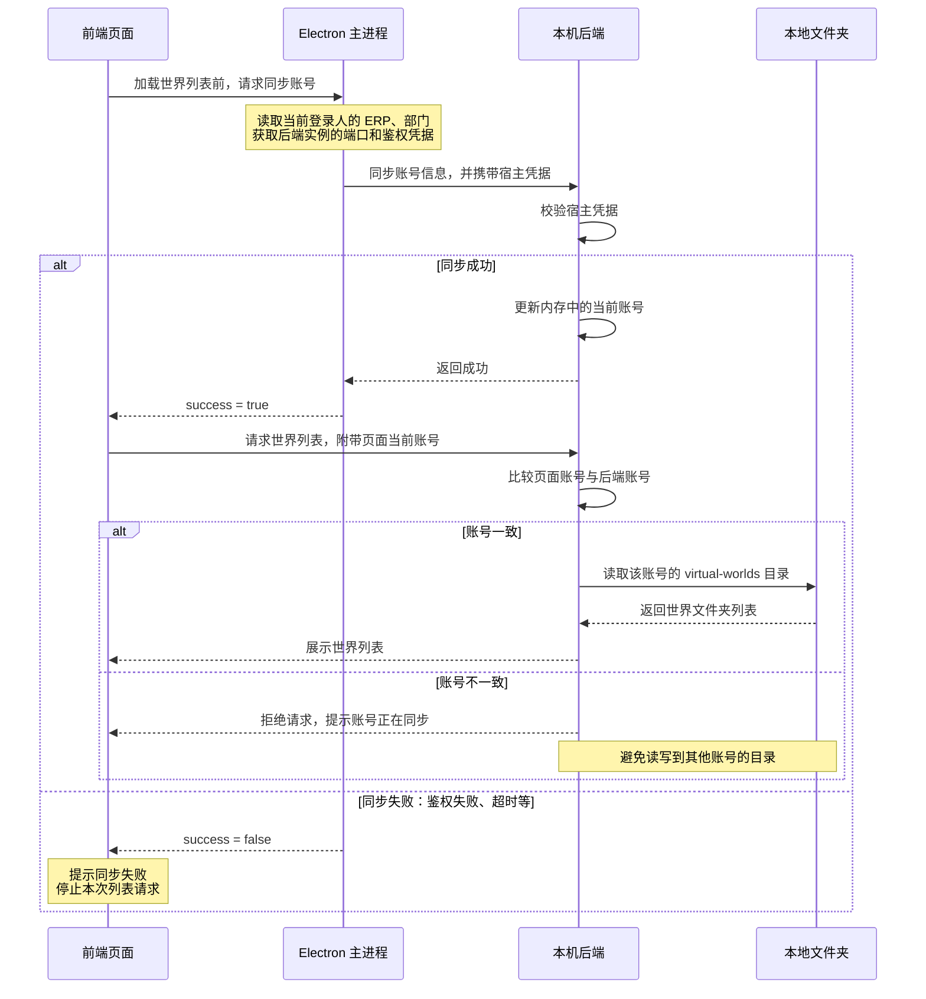

# 虚拟世界第一步：本地世界管理

- 分支：`virtual-world-development`，基于 `feature/202609`。
- 知识库下新增“虚拟世界”菜单；输入名称创建，列表支持按名称搜索。
- Vue 页面调用 Desk Nest 接口，在当前账号的 `virtual-worlds/世界名称/` 创建文件夹；目录是数据持久化单源。
- 补充非法名称、重名、路径和账号隔离校验；修复主进程同步账号时遗漏凭据的问题。
- UI 参考现有菜单；卡片不显示本地路径，创建弹窗删除“输入世界名称，将在本地创建同名文件夹”的提示。

## 账号同步补充

- **目的**：Electron 主进程将当前登录人的 ERP 和部门信息传给本机后端，保证世界目录归属正确。
- **原问题**：已有同步请求漏带 `x-joydesk-host-control` 宿主凭据，后端会拒绝；旧代码未检查 HTTP 状态，失败仍被当作成功。
- **修复**：从正在运行的后端实例取得端口和凭据，请求固定发往 `127.0.0.1:<端口>/api/runtime/current-user`；禁止重定向、设置 5 秒超时、检查 HTTP 状态，并向前端返回真实结果。宿主凭据不传给前端。
- **使用**：加载世界列表前，前端等待已有 `auth.syncCurrentUser()` 完成。读列表和创建世界都校验前端携带的预期账号与后端 ERP 是否一致；目录只由后端账号决定。不一致返回 409，避免账号切换时读写错目录。创建操作本身不额外发起同步。
- **范围**：修复的是已有通用同步方法，登录、续期、退出等调用也受益；退出沿用传空 ERP 清除身份的机制。账号同步修复已本地提交为 `298282fe6f`，尚未推送。

来源：2026-09-20 本次开发对话；提交 `298282fe6f`；代码入口 `apps/desk/electron/current-user-sync.ts`、`apps/desk/electron/main.ts`、`apps/desk/frontend/src/services/virtualWorldClient.ts`、`apps/desk/backend/nest/modules/virtual-world/virtual-world.service.ts`。
