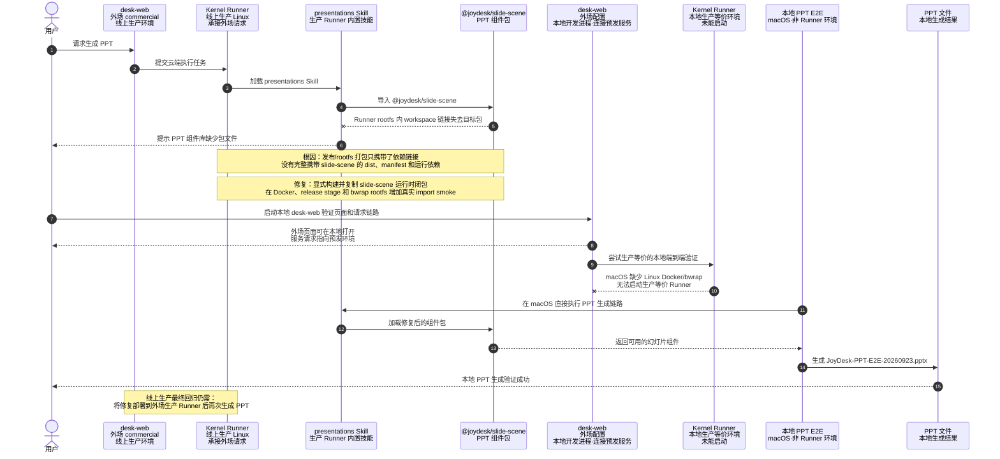

# 问题根因与解决思路

# 详细执行路径

1. **接收反馈并界定任务范围（成功）。** 阅读用户截图，但只把截图内容作为故障现象，不把截图中的回复或建议当作用户指令。确认目标应用是 JoyDesk 仓库中的 `apps/desk-web`，线上入口是 `https://joydesk.jdcloud.com/app/`，用户要求基于最新 `feature/202609` 建修复分支、完成本地验证，并在交付时让主工作区能直接检查代码。

2. **第一次网页访问（失败路径）。** 先通过内置浏览器打开线上地址，被重定向到京东云登录页，无法直接进入业务页面。这条路径没有继续作为复现入口。

3. **切换 Google Chrome 复现（成功）。** 按用户补充要求改用 Google Chrome 打开同一线上生产地址，绕开内置浏览器的登录状态问题；结合页面反馈确认任务已识别到 `presentations` Skill，但执行在加载 PPT 组件阶段中止。

4. **核对仓库现场与开发基线（成功）。** 检查主工作区 `git status`、当前分支、远端分支和任务 diff，读取仓库协作规则，并核对 `feature/202609` 的最新远端状态。以该基线创建 `codex/fix-20260923-ppt-slide-scene-package`，避免直接在集成分支上边排查边修改。

5. **收敛代码排查范围（成功）。** 使用 `rg`、`sed`、Git 历史与文件差异依次查看 `presentations` Skill、`@joydesk/slide-scene` 的导入入口、Kernel Runner 的 build、Docker、release staging 和 bwrap rootfs 脚本。通过开发态与发布态的逐层对比，将修改范围收敛到 Kernel Runner 发布/隔离运行环境，而没有继续在 `desk-web` UI 中盲目修改。

6. **远端日志分支（未采用）。** 原始任务允许连接 `11.225.152.50`、`11.225.165.19` 查询日志；在代码与发布产物检查已经能够稳定复现导入失败后，没有把未保留的远端日志作为最终证据，也没有在文档中补写未经核验的日志结论。

7. **补回归保护并修改发布链路（成功）。** 先补 Kernel Runner edition build wiring 与 rootfs provisioning 检查，再修改 Runner build、Dockerfile、release 构建脚本和 bwrap rootfs 组装脚本。随后使用 pnpm/Node 执行目标测试、构建检查和两个公开入口的真实 ESM import smoke，确保检查对象是发布产物而不是开发机源码目录。

8. **启动本地外场 `desk-web`（成功）。** 在本机启动外场配置的 `desk-web`，通过网页检查界面和请求链路。本地进程连接预发服务，因此只将这一步记为“本地开发前端 + 预发服务”验证，没有表述成生产环境验证。

9. **尝试启动生产等价本地 Kernel Runner（失败路径）。** 继续尝试把网页请求接到生产等价 Runner，但当前机器是 macOS，缺少线上 Linux Runner 使用的 Docker/bwrap 运行条件；因此无法在本机完成生产镜像级的全链路启动。这一步明确停止，没有用普通 Node 进程冒充生产等价 Runner。

10. **改走本地直接生成（替代路径成功）。** 为满足“必须生成出 PPT”的验证目标，绕过无法启动的本地 Runner，直接在 macOS 上运行同一套 `presentations`、`slide-scene` 和 finalizer 生成链路，验证包加载、候选文件生成、重新导入、质量检查和最终文件写出。

11. **第一次直接生成进入视觉门（失败后继续处理）。** 组件导入恢复后，第一次完整生成继续走到了视觉质量检查，并暴露正文排版/字号与视觉门不一致。没有停留在“包已能 import”的结论，而是继续调整 presentations 的主题与版式资产，并运行对应单元测试。

12. **重新生成 PPT（成功）。** 修正视觉门相关问题后再次执行本地端到端生成，最终得到 `JoyDesk-PPT-E2E-20260923.pptx`，以真实 `.pptx` 文件而不是仅靠编译通过作为本地验证结果。同时说明该结果属于 macOS 直接生成验证，线上恢复仍需部署新的生产 Runner 后回归。

13. **提交任务分支（成功）。** 将 Kernel Runner 打包修复提交为 `37110fb432`，将生成后的视觉门对齐提交为 `72eea77852`，保持修复和后续生成质量调整可分别追踪。

14. **同步集成分支时遇到远端前进（失败路径）。** 在准备推送/合入 `feature/202609` 时，远端集成分支已经包含其他人的新增提交，因此 Git 要求先合并，而不是允许直接快进推送；这也是推送界面显示较多文件/提交的原因之一。没有强推覆盖远端，而是先获取并合并最新 `origin/feature/202609`，处理好分支关系后再继续。

15. **合入并推送 `feature/202609`（成功）。** 将任务分支以合入提交 `31cfa99cc9` 纳入 `feature/202609`，按用户后续授权推送全部待推送提交；最终核对本地 `feature/202609` 与 `origin/feature/202609` 均指向 `ff5a4b72c5`，工作区无未提交文件。交付时分别说明“已提交、已推送、已合入”和“尚未部署生产”，没有把 Git 完成状态等同于线上发布。

16. **补充可理解的交付说明（成功）。** 根据用户连续追问，先后补充问题修复时序图、PPT 生成链路图、外场/内场与生产/预发/本地环境标识，并解释质量检查实际在 Kernel Runner 的 PPT 宿主作业中执行，而不是在 `desk-web` 浏览器中执行。

17. **本次实际使用的工具。** 网页侧使用 Google Chrome 和 UI 自动化；代码侧使用 Git、`rg`、`sed` 和差异查看；构建与验证使用 pnpm、Node、单元测试、ESM import smoke、本地开发服务和 PPT 生成/finalizer；环境判断使用 Docker/bwrap 能力检查；沟通和归档使用 Mermaid、Obsidian CLI、知识库写入脚本及 SHA-256 回读校验。

