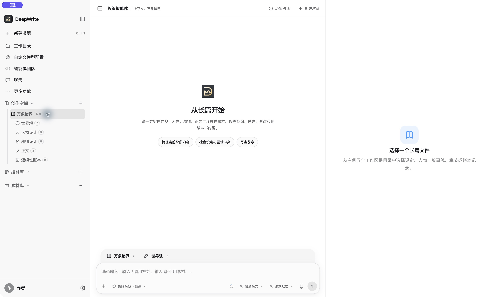
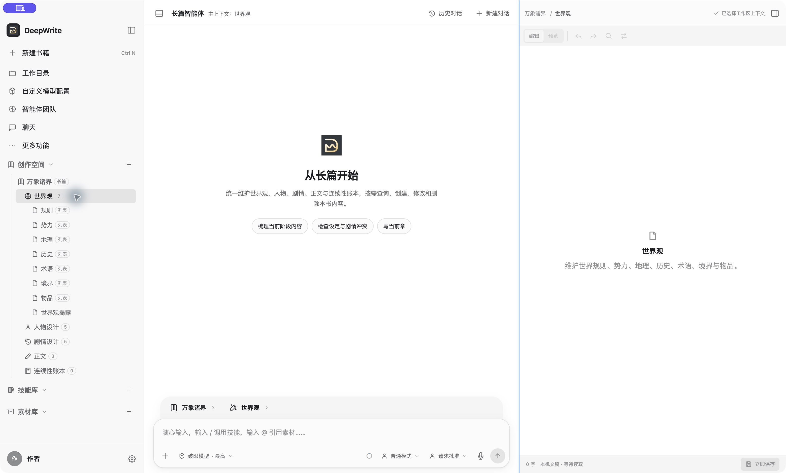
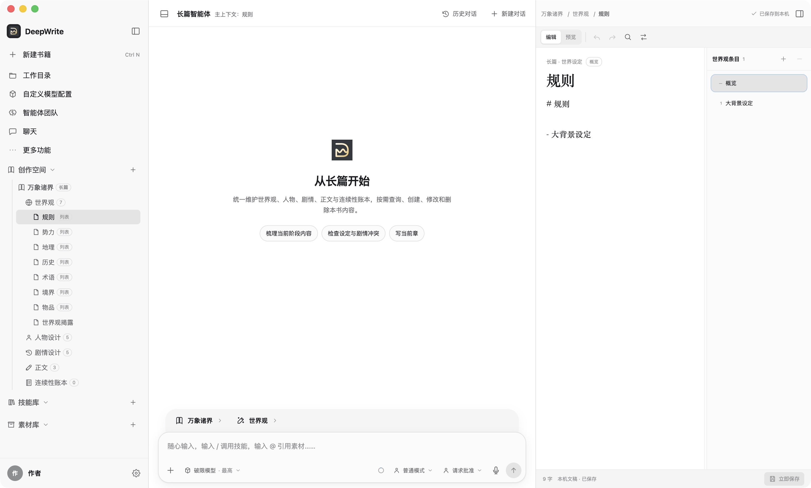
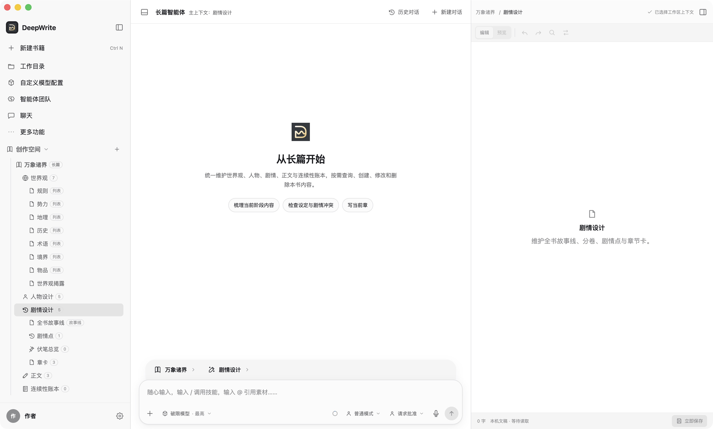
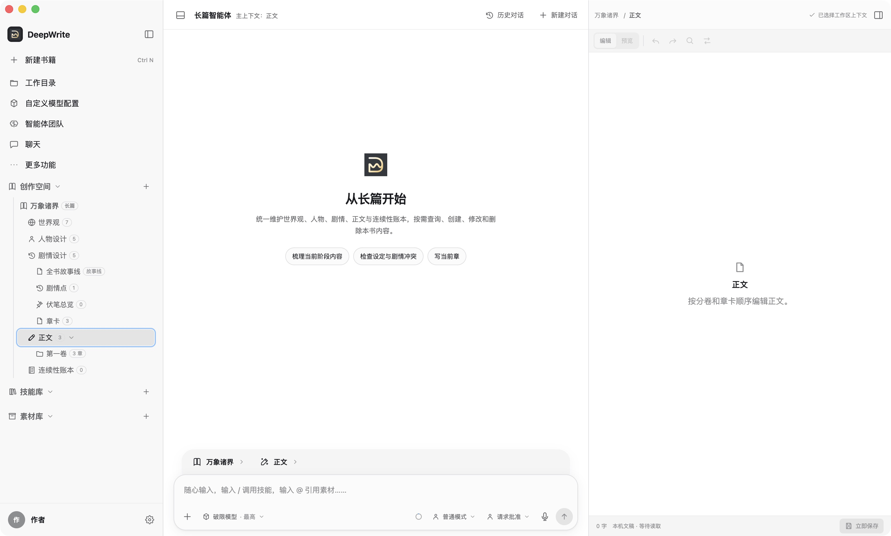
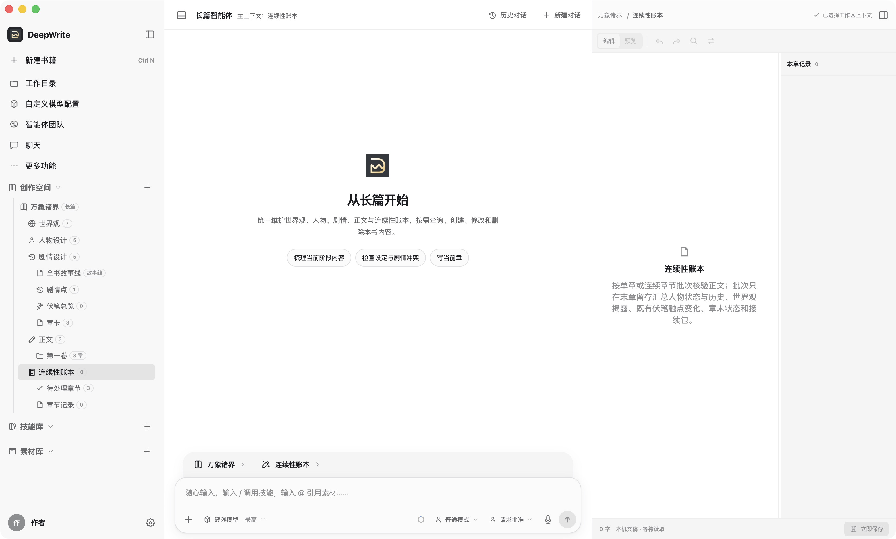

# DeepWrite《万象诸界》使用说明：修订设定与创作新章

本说明按 2026 年 9 月 27 日启动的 DeepWrite 桌面开发版编写。服务地址为 `http://localhost:5173/`；截图均来自运行中的“万象诸界”创作空间。左侧数字是当时的条目数量，会随创作变化。

进入“创作空间 → 万象诸界”后，左侧依次是世界观、人物设计、剧情设计、正文和连续性账本。中间是长篇智能体对话，右侧是当前选中文件的编辑器。**先选左侧目标文件，再编辑或让 Agent 操作**，可以让它获得正确的阶段上下文。



## 任务一：修改世界观设定或故事情节

### 修改世界观

1. 展开“世界观”，选中对应分类，例如“规则”“势力”“地理”。这里的分类用于组织设定；右侧编辑器里才是分类概览和具体条目。
2. 选“概览”可查看或修改该分类的索引；选已有条目可改详细设定。要新增条目，点击右侧“世界观条目”标题旁的 **＋**。
3. 修改后确认右下角显示“已保存到本机”；若显示“立即保存”，点击保存。新增或修改条目时，**同步更新“概览”**，用几句话说明有哪些设定及其关系，不必把条目全文复制进去。





### 修改故事情节

1. 展开“剧情设计”。若改变的是全书方向，打开“全书故事线”；若改变某一段剧情，进入“剧情点 → 所属分卷 → 对应剧情点”。
2. 在剧情点内，先看“概要”（触发原因、人物选择、直接后果和局面变化），再切到“故事情节”调整场景顺序、信息投放、人物选择与情绪推进。这里写的是**情节设计**，不是小说正文。
3. 若改动会影响尚未写的章节，再检查“章卡”里的本章任务、场景、人物和伏笔安排；涉及伏笔时检查“伏笔总览/伏笔触点”。若已写章节也需要跟着改，应明确决定要改哪些正文，避免新设定和已写事实冲突。
4. 完成后可点中间的“检查设定与剧情冲突”，请 Agent 对照相关世界观、人物、剧情和已写正文检查。让 Agent 代改时，明确点名目标条目与允许修改的范围，并审阅写入提案。



可直接发给 Agent 的示例：

> 请先读取“规则”中的相关世界观条目、第一卷的剧情点和已写正文。我要把【旧设定/情节】改为【新设定/情节】。先指出冲突和受影响的文件；只修改我确认的世界观条目、分类概览与故事情节。暂不改正文、章卡或连续性账本。

## 任务二：自己规划新章，让 Agent 写正文并更新人物状态

### 1. 先处理已有章节的接续信息

当前截图中，前三章已有正文，但“连续性账本 → 待处理章节”为 **3**，“章节记录”为 **0**。因此，人物设计中的“当前状态”“历史轨迹”还没有这些章节的已提交记录可映射。正式继续写新章前，建议先核验并提交前三章，可逐章提交，也可把连续的已写章节作为一个批次提交。批次只在末章汇总最终状态与下一章接续包。

### 2. 自己完成新章设计

在“剧情设计 → 章卡 → 所属分卷”中新建或选中下一张章卡。先确认它与剧情点、故事情节和世界设定一致，再填写本章目标、场景顺序、出场人物、起止状态、关键选择、信息披露、伏笔、结尾钩子和目标字数。**章卡写任务，不写小说正文**；每张章卡对应一章正文。

可按下面的简表整理后填入章卡：

```text
本章目标：
场景顺序：
出场人物及关系变化：
必须遵守的世界规则：
起始状态 → 结束状态：
关键选择及后果：
要披露的信息、要推进的伏笔：
结尾钩子：
目标字数：
```

### 3. 让 Agent 写当前章正文

在左侧“正文 → 所属分卷”中选中这张章卡对应的章节，核对中间对话区显示当前书籍为“万象诸界”、阶段为“正文”。可以点击“写当前章”，也可以发下面的明确指令。审阅 Agent 的修改提案、成稿和右侧保存状态；若本章正文含图片引用，审阅时检查引用仍在原位且路径未被改坏。



> 请读取当前章卡、相关故事情节和世界观、出场人物的核心档案与关系，以及前章正文和接续包。只写当前章的小说正文，遵循我定好的场景与结尾，保留已有图片引用。完成后供我审阅；暂不提交连续性账本，也不要自行改动世界观或剧情设计。

### 4. 审定正文后，请 Agent 补连续性账本

正文定稿后，打开“连续性账本 → 待处理章节”，选中本章，请 Agent 以**最终正文**为依据生成并提交记录。核对人物变化、世界观新揭露、已有伏笔触点是否兑现，以及章末状态和下一章接续包。提交后该章进入“章节记录”，人物设计里的“当前状态”和“历史轨迹”才会从最新已提交记录映射出来。

“核心档案”“人物关系”是人物设定文件，**不会仅因提交账本自动改写**。如果正文确实改变了人物的稳定设定或长期关系，再单独要求 Agent 检查并更新相应人物文件；不要把尚未在正文发生的计划写成既成事实。



> 请读取【本章】最终正文和伏笔总览中已有的触点，核验并提交本章连续性记录。只记录正文确实发生的变化，汇总人物当前状态与历史轨迹、必要的世界观揭露、既有伏笔变化、章末状态和下一章接续包。提交前让我核对内容；如需修改人物核心档案或人物关系，先列出建议，不要直接改。

按这个顺序工作即可：**修订上游设定与情节 → 自己定章卡 → Agent 写正文 → 人工审定 → Agent 补账本 → 检查人物状态与接续包**。
